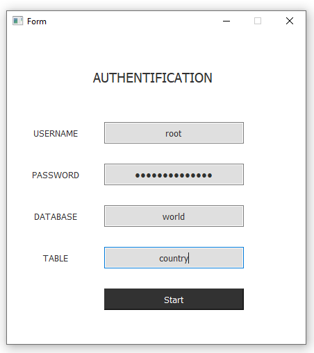
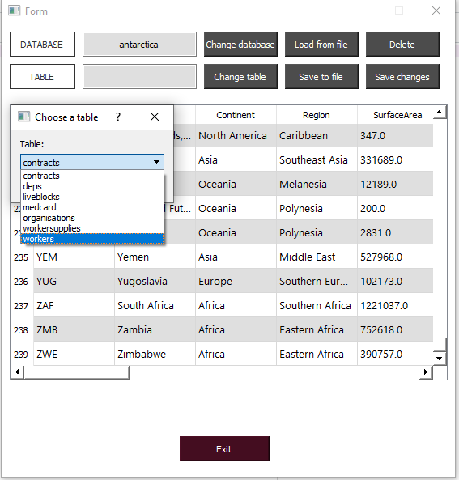

# Database-GUI-Project
A GUI to work with mysql databases, created with PyQt and QtDesigner. 
You can work with any database and table that you have access to. 

Note that a table must have an integer ID as its first column so all the functions can work properly. You can switch between tables of the current database by typing a table name and you can switch between databases by typing a database name and choosing one of its tables. 

You can load table data from a csv file to the workspace or save current workspace to a csv file. 
You can delete selected record by cicking Delete button.
You can send changes in the current workspace to database by clicking Save changes button.
## Requirements
You need to have Python 3.x, PyQt5 and mysql-connector installed on your computer. 
To launch the app, download this repo files and run form.py file
